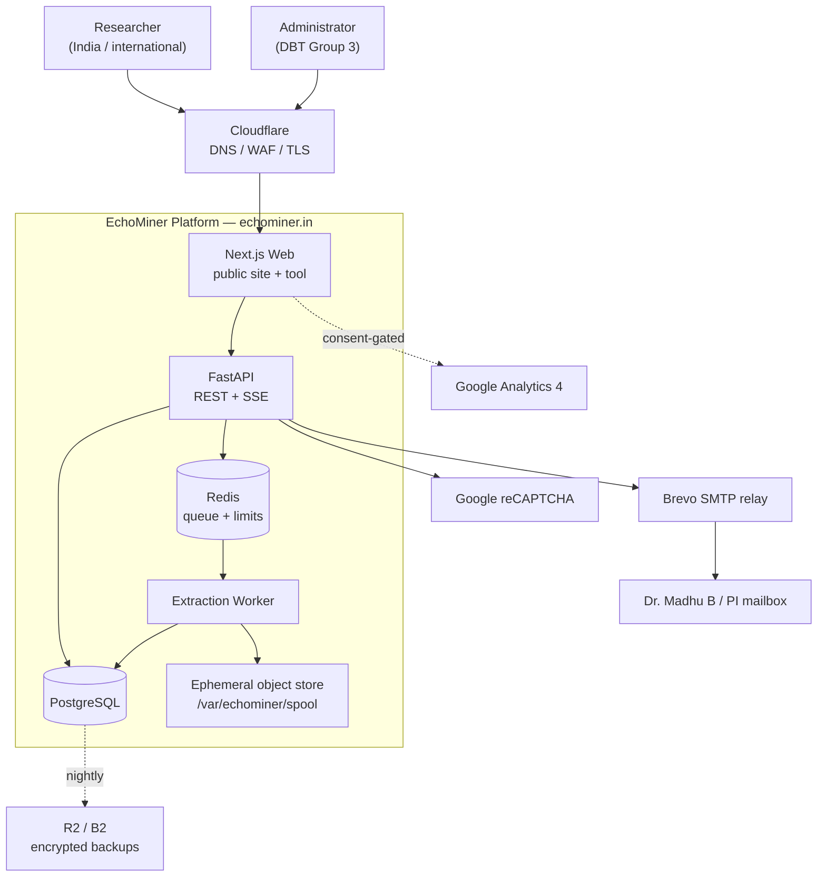
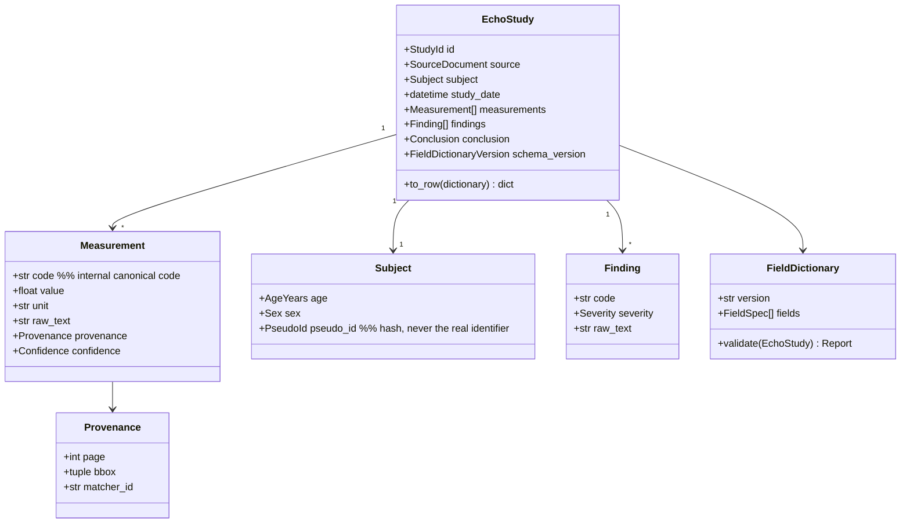
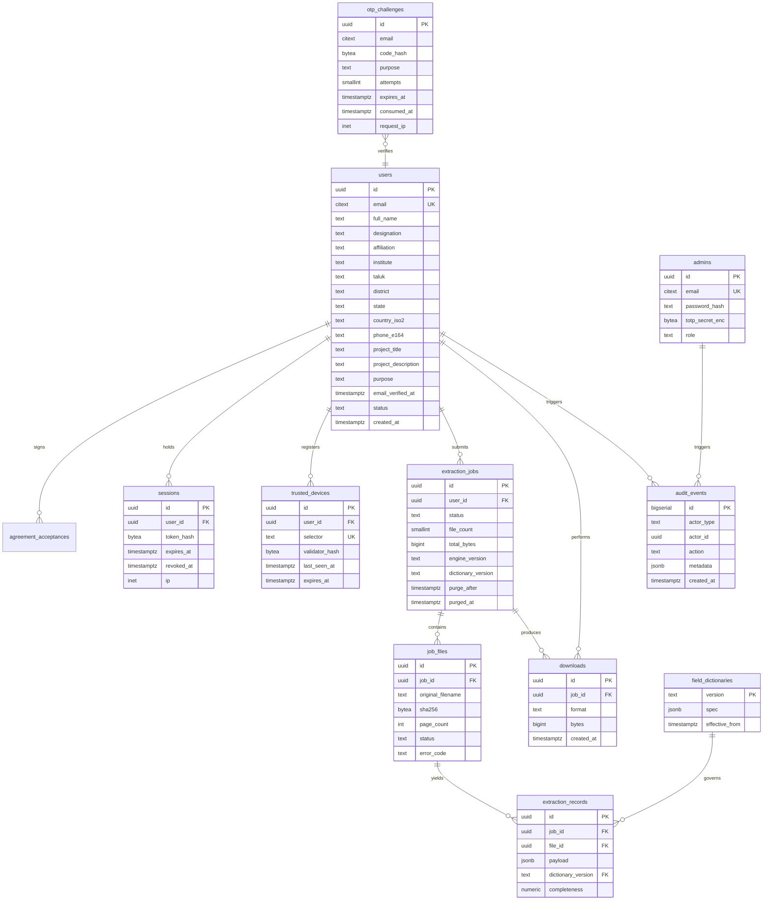
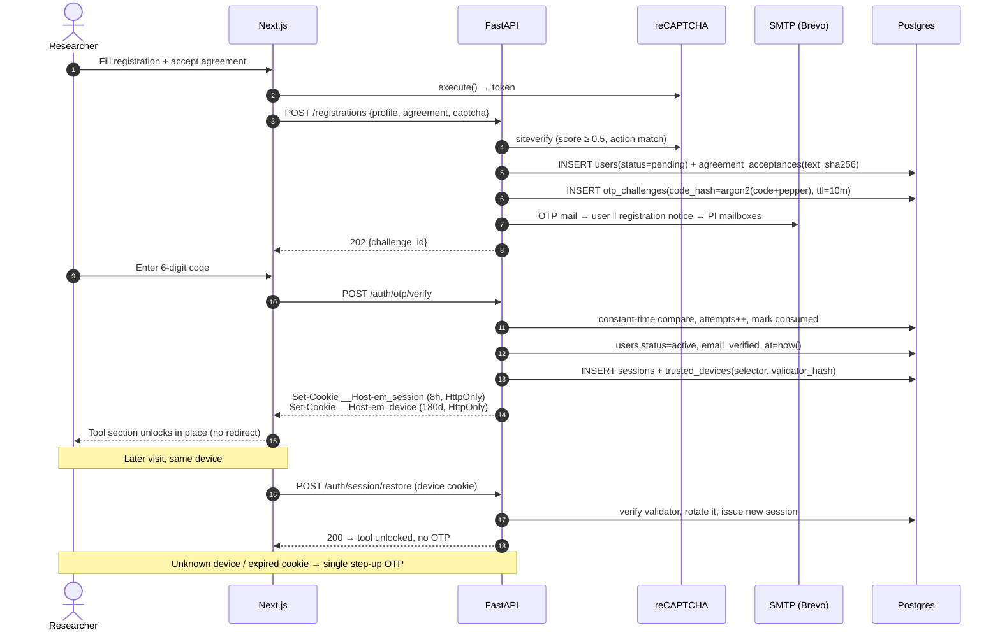
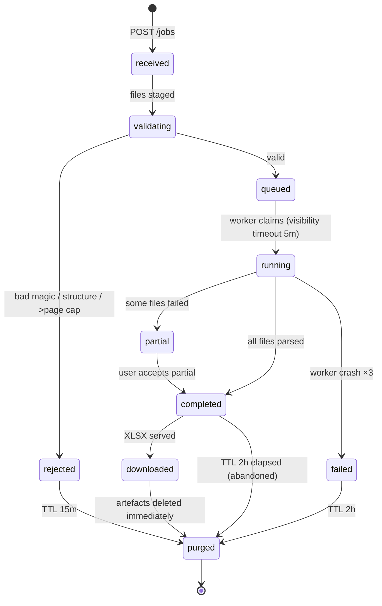
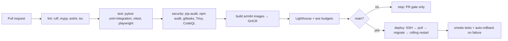

# EchoMiner — Software Architecture Document (SAD)

**Version:** 0.2 — decisions resolved 8 Aug 2026; extraction engine audited and hardened
**Target domain:** https://echominer.in
**Owner:** DBT-BUILDER Group 3, Dept. of Community Medicine, JSS Medical College, JSS AHER, Mysore
**Status:** Architecture baseline for review. No application code written yet, by design.

---

## 0. Blockers and discrepancies (read first)

These are unresolved items in the brief. Items marked **BLOCKER** stop a module from being built correctly; items marked **DECISION** need your ruling before code is written; items marked **RISK** are accepted-with-mitigation unless you object.

| # | Item | Ruling | Status |
|---|---|---|---|
| B1 | Extraction pipeline | `echo_extractor.py` + `requirements.txt` supplied | **Resolved.** Audited, 11 defects found and reproduced, hardened to `echominer-engine/2.0.0`. See `PARSER_AUDIT.md`. Two segmentation defects affect record counts — read A1/A2 before the next manuscript revision. |
| B2 | Patient data | JSS-internal users, ethical clearance held by uploaders; upload freely, no blocking | **Accepted with one open question (Q-A below).** No gate, no redaction, Name/Address retained in output. Raw PDFs still never persist beyond the job (that is a reliability and disk decision, not a policy one). |
| D1 | Returning-user auth | Trusted-device cookie model approved | **Resolved.** §8 stands as written. |
| D2 | Hosting | Oracle Cloud Always Free + Cloudflare + Brevo approved | **Resolved.** No tenancy exists yet → provisioning is a new task, see §2.5. |
| D3 | Sender identity | Approved, conditional on not creating a mailbox | **Resolved — no mailbox needed.** See §16.5: outbound sending needs DNS records only. |
| D4 | Citation | Zenodo DOI supplied | **Resolved.** Canonical record in §10.1; all five formats generated from it. |
| R1 | Logos | JSS AHER logo supplied | **Partially resolved.** Web assets built (transparent PNG, 3 widths). **DBT logo was not attached** — still needed. |
| R2 | Retention | Suggested solution approved | **Resolved.** Artefacts purged, metadata retained. |
| R3 | Free-tier volatility | Proposed mitigation approved | **Resolved.** IaC + rehearsed restore. |
| R4 | Virus scanning | Dropped entirely | **Resolved.** ClamAV removed; ~1.5 GB returned to the budget. Structural PDF validation and container hardening remain (§14.5) — they cost nothing and are what actually protects a PDF parser. |
| R5 | Captcha | Port-based approach approved | **Resolved.** reCAPTCHA v3 + v2 fallback behind a swappable port. |
| 7 | Upload limit | 20 files maximum | **Resolved.** 20 files / 200 MB total / 2000 pages per file. |
| 8 | Project content | DBT-BUILDER text + team roster supplied | **Resolved.** Verbatim in §12.4. No figures invented. |
| 9 | Oracle tenancy | Does not exist | **Open — on the critical path for M12 only.** §2.5. |

### Remaining open questions

**Q-A (blocks nothing, but decide before launch).** Your brief specifies a portal for "researchers across India and internationally" with open registration; your ruling states users will be from JSS only. Those describe different systems. Two options, both cheap:
- **Open registration** (as the brief reads) — anyone worldwide can register and upload. Then the JSS-only premise no longer holds, and uploaders' ethical clearance is asserted rather than known.
- **Institutional allow-list** — registration restricted to configured email domains (`@jssuni.edu.in` by default, extendable per collaboration from the admin panel). The public site, documentation, citation and DBT sections stay fully open; only *upload* is gated.

The allow-list is one config value and one validator, and it makes the JSS-only premise true rather than assumed. It is also the version that survives a reviewer or an institutional audit asking who uploaded what. Say which you want; I will build either.

**Q-B.** The DBT logo file.

**Q-C.** 2–3 real or de-identified archive PDFs, to convert the synthetic fixtures into golden-file tests.

**Q-D.** `requirements.txt` version conflict — see the environment discrepancy note in `PARSER_AUDIT.md`. Confirm which pin set produced the published results.

---

## 1. Scope and non-functional requirements

### 1.1 What the system is
A single-page public research portal that (a) presents the EchoMiner project, (b) registers and verifies academic users, (c) accepts batches of echocardiography report PDFs, (d) runs the existing extraction pipeline, (e) returns a branded, citable Excel workbook, and (f) gives administrators usage oversight — while being structured so that DICOM, FHIR, SNOMED CT, ICD-10, PACS and model-based analytics can be added later as *adapters*, not rewrites.

### 1.2 Non-functional targets

| Attribute | Target | Verified by |
|---|---|---|
| Availability | 99.0% monthly (≈7 h/month budget) — honest for a single free VM | Uptime probe + status page |
| Cold-start latency | None. Service is always-on (this is why Render Free is rejected) | Synthetic probe every 5 min |
| Page LCP | ≤ 2.0 s on 4G from India, ≤ 2.5 s international | Lighthouse CI in the pipeline |
| Extraction throughput | ≥ 20 PDFs/min/worker on 2 ARM OCPU; **20 files / 200 MB per job** | Load test in `tests/load` |
| Job completion | p95 < 60 s for a 20-file batch | Prometheus histogram |
| RPO / RTO | RPO 24 h (nightly encrypted dump), RTO 4 h | Quarterly restore drill (scripted) |
| Accessibility | WCAG 2.2 AA | axe-core in CI + manual keyboard pass |
| Data retention | Raw PDFs and generated XLSX: ≤ 2 h, or immediately on download | Purge job metrics + audit log |
| Security posture | OWASP ASVS L2 | Checklist in §15 |

### 1.3 Explicit non-goals for v1
Multi-tenant institutions, per-user quotas beyond rate limits, real-time collaboration, DICOM ingest, FHIR export, model inference. All have reserved seams (§20) and none are built now.

---

## 2. Deployment: comparison and recommendation

### 2.1 Free-tier reality check (verified August 2026)

| Platform | Free compute | Free Postgres | Always-on? | Verdict for EchoMiner |
|---|---|---|---|---|
| **Render** | 750 instance-h/mo, but <cite index="12-1">free web services spin down after 15 minutes of inactivity and take about a minute to cold-start on the next request</cite> | <cite index="18-1">Free Postgres databases expire after 30 days</cite> | No | **Rejected.** A database that dies every 30 days disqualifies it outright; a 30–60 s cold start on a portal for international researchers is not "production-ready." |
| **Railway** | <cite index="16-1">No permanent free tier. New accounts get a one-time $5 trial credit valid for 30 days. After that you need the Hobby plan at $5/month</cite> | Metered | Paid only | **Rejected** — violates the "no recurring cost" constraint. |
| **Fly.io** | <cite index="17-1">Fly.io removed free allowances in 2024</cite>; pure per-second billing | Metered volume | Paid only | **Rejected** — same reason. Also <cite index="14-1">egress jumps to $0.12/GB in India</cite>. |
| **Oracle Cloud Always Free** | Ampere A1 ARM, <cite index="4-1">now 2 OCPUs and 12 GB RAM, down from 4 OCPUs and 24 GB</cite>, plus <cite index="3-1">200GB block storage, 10TB outbound bandwidth, and 2 AMD micro instances</cite> | Self-hosted in Docker on the block volume | **Yes** | **Recommended.** Only option that is simultaneously free, always-on, and capable of running Postgres + workers + ClamAV. |
| **Paid VPS (Hetzner/DigitalOcean/Indian VPS)** | ~₹400–900/mo | Self-hosted | Yes | Best engineering outcome, but violates the stated constraint. Keep as the documented escape hatch. |

### 2.2 Recommendation

```
Registrar: GoDaddy (echominer.in) — keep registration, delegate nameservers
     │
Cloudflare (free): DNS, proxy, TLS edge, WAF rules, DDoS, cache, origin-IP hiding
     │
Oracle Cloud Always Free — VM.Standard.A1.Flex, 2 OCPU / 12 GB, Ubuntu 24.04 LTS
     │  ap-hyderabad-1 (primary) → ap-mumbai-1 → ap-singapore-1 on capacity error
     ├── nginx (TLS termination, HSTS, rate limits, static cache)
     ├── web        (Next.js, standalone output)
     ├── api        (FastAPI + Uvicorn, 2 workers)
     ├── worker     (extraction jobs, ARQ/Redis queue)
     ├── postgres   (17, on 200 GB block volume, WAL archiving)
     ├── redis      (queue + rate limits + OTP throttle)
     └── clamav     (scan sidecar, fail-closed)
     │
Backups: nightly pg_dump + WAL → age-encrypted → Cloudflare R2 / Backblaze B2 free tier
Email:   Brevo free SMTP relay (300 msg/day) as noreply@echominer.in
```

**Why this and not the alternatives:** the only hard requirement Oracle satisfies uniquely is *free + always-on + you control the database*. Everything else on the list either sleeps, expires the database, or bills monthly.

**Honest exposures of this choice** — do not let anyone tell you these are theoretical:
1. Oracle can and does cut allowances silently (R3). Mitigation: the entire stack is `docker-compose.yml` + `.env` + a restore script. Migration to a ₹500/mo VPS is a documented, rehearsed procedure in `docs/DISASTER_RECOVERY.md`.
2. Always-Free tenancies can be reclaimed for inactivity. Mitigation: the app itself generates continuous load; add a billing-alert-free PAYG upgrade only if you accept a card on file (this also makes ARM capacity easier to obtain).
3. ARM capacity errors are common. Mitigation: region fallback order above; provisioning script retries.
4. Single VM = single point of failure. Accepted at 99.0%. The DR path (restore to any Docker host in ≤4 h) is what makes it acceptable, not redundancy.

### 2.5 Provisioning the tenancy (new task — no account exists)

1. Sign up at cloud.oracle.com with an institutional email. Home region **must** be chosen at signup and cannot be changed later — pick `ap-hyderabad-1` (lowest latency from Mysuru; `ap-mumbai-1` as second choice).
2. A payment card is required for identity verification even on Always Free; a temporary authorisation is placed and reversed. The account stays Free unless you explicitly upgrade. Set a ₹0 budget alert immediately.
3. Create `VM.Standard.A1.Flex`, **2 OCPU / 12 GB**, Ubuntu 24.04, 200 GB boot volume, SSH key auth only.
4. "Out of host capacity" on ARM is routine. Retry across availability domains, then fall back `ap-hyderabad-1 → ap-mumbai-1 → ap-singapore-1`. `infra/scripts/provision.sh` retries on a schedule.
5. Security list: inbound 22 (your IP only), 80 (ACME), 443. Everything else denied. Cloudflare proxies 443 so the origin IP stays hidden.
6. Because the account is new, do this **early** — capacity hunting can take days and it is the one launch dependency that cannot be compressed by working harder. Development proceeds locally on Docker Compose meanwhile; nothing else waits on it.

### 2.3 Resource budget on 2 OCPU / 12 GB

| Service | Memory limit | CPU share | Note |
|---|---|---|---|
| nginx | 128 MB | 0.1 | |
| web (Next.js) | 512 MB | 0.3 | `output: standalone`, SSG where possible |
| api (FastAPI ×2 workers) | 1.0 GB | 0.5 | |
| worker (×2) | 3.5 GB | 0.7 | PyMuPDF is memory-hungry per document; hard page cap. Gains ClamAV's freed budget. |
| postgres | 2.0 GB | 0.3 | `shared_buffers=512MB`, `work_mem=16MB` |
| redis | 256 MB | 0.1 | `maxmemory-policy allkeys-lru` |
| **Total reserved** | **~6.4 GB** | | ~5.5 GB headroom for page cache and burst |

---

## 3. System architecture

### 3.1 Context



### 3.2 Layering (hexagonal / ports-and-adapters)

The forward-compatibility requirement (DICOM, FHIR, SNOMED, ICD-10, PACS, EMR, AI analytics) is *the* reason for this shape. The domain never imports a framework, a driver, or a vendor SDK.

```mermaid
graph LR
    subgraph Inbound["Inbound adapters"]
        HTTP["FastAPI routers"]
        CLI["CLI / batch"]
        FUT1["Future: HL7 FHIR API<br/>Future: DICOM SCP"]
    end
    subgraph App["Application layer (use cases)"]
        UC1["RegisterUser"]
        UC2["VerifyOtp"]
        UC3["SubmitExtractionJob"]
        UC4["BuildWorkbook"]
        UC5["AdminAnalytics"]
    end
    subgraph Domain["Domain (pure Python)"]
        E1["EchoStudy / Measurement<br/>Finding / Subject"]
        E2["FieldDictionary v1..n"]
        E3["Policies: retention,<br/>de-identification, agreement"]
    end
    subgraph Ports["Ports (Protocols)"]
        P1["ExtractionEngine"]
        P2["Repository"]
        P3["Mailer"]
        P4["Captcha"]
        P5["BlobStore"]
        P6["VirusScanner"]
        P7["TerminologyService"]
        P8["Exporter"]
    end
    subgraph Outbound["Outbound adapters"]
        A1["PyMuPDF parser<br/>(your existing pipeline)"]
        A2["SQLAlchemy / Postgres"]
        A3["Brevo SMTP"]
        A4["reCAPTCHA / Turnstile"]
        A5["Local FS → S3-compatible"]
        A6["ClamAV"]
        A7["Future: SNOMED CT / ICD-10"]
        A8["openpyxl XLSX / CSV / Future FHIR Bundle"]
    end

    Inbound --> App --> Domain
    App --> Ports
    Ports --> Outbound
```



**The rule that makes future integration cheap:** the parser's output is normalised into a canonical `EchoStudy` aggregate immediately at the boundary. The Excel exporter, the future FHIR exporter, and any future ML feature-builder all read `EchoStudy` — none of them read parser output. Adding FHIR later means writing one `Exporter` adapter, not touching the pipeline.

---

## 4. Repository and folder structure

Monorepo, because the OpenAPI schema must stay in lockstep with the TypeScript client.

```
echominer/
├─ apps/
│  ├─ api/                          # FastAPI service
│  │  ├─ echominer/
│  │  │  ├─ domain/                 # pure: entities, value objects, policies
│  │  │  │  ├─ echo/                # EchoStudy, Measurement, FieldDictionary
│  │  │  │  ├─ identity/            # User, Registration, Agreement, Otp
│  │  │  │  └─ policy/              # retention, deident, rate, eligibility
│  │  │  ├─ application/            # use cases, DTOs, unit-of-work
│  │  │  ├─ ports/                  # Protocol definitions only
│  │  │  ├─ adapters/
│  │  │  │  ├─ persistence/         # SQLAlchemy models, repositories
│  │  │  │  ├─ extraction/          # ← your pipeline wrapped here
│  │  │  │  ├─ mail/  captcha/  blob/  scan/  export/
│  │  │  ├─ interfaces/
│  │  │  │  ├─ http/                # routers, schemas, deps, errors
│  │  │  │  └─ worker/              # ARQ task definitions
│  │  │  ├─ config.py  logging.py  telemetry.py
│  │  ├─ alembic/versions/
│  │  ├─ tests/{unit,integration,contract,security}/
│  │  └─ pyproject.toml
│  └─ web/                          # Next.js (App Router)
│     ├─ app/
│     │  ├─ (public)/page.tsx       # single-page home + tool
│     │  ├─ (public)/{privacy,terms,cite}/page.tsx
│     │  ├─ admin/                  # admin SPA segment
│     │  ├─ api/                    # BFF route handlers (cookie proxy only)
│     │  ├─ sitemap.ts  robots.ts  opengraph-image.tsx
│     ├─ components/                # see §13
│     ├─ lib/{api-client,analytics,seo,a11y}/
│     ├─ public/brand/              # jss-aher.svg, dbt.svg, echominer.svg
│     └─ tests/{unit,e2e}/
├─ packages/
│  ├─ api-types/                    # generated from OpenAPI
│  └─ field-dictionary/             # single source of truth for extracted fields
├─ infra/
│  ├─ docker/{api,web,worker,nginx}.Dockerfile
│  ├─ compose/{docker-compose.yml,docker-compose.prod.yml}
│  ├─ nginx/{echominer.conf,security-headers.conf}
│  ├─ terraform/                    # OCI VM, block volume, security lists
│  └─ scripts/{backup.sh,restore.sh,purge.sh,provision.sh}
├─ docs/
│  ├─ ARCHITECTURE.md (this)  API.md  DEPLOYMENT.md  DNS_GODADDY.md
│  ├─ SECURITY.md  PRIVACY_DPDP.md  RUNBOOK.md  DISASTER_RECOVERY.md
│  └─ adr/0001-*.md                 # architecture decision records
├─ .github/workflows/{ci.yml,cd.yml,security.yml,backup-verify.yml}
└─ Makefile
```

---

## 5. Domain model



**Forward-compatibility seams built in now, costing almost nothing:**

| Future capability | Seam that already exists |
|---|---|
| HL7 FHIR R4 export | `Measurement.code` is a canonical internal code; a `CodeMapping` table maps it to LOINC/SNOMED. `Exporter` port gains a `FhirBundleExporter` adapter emitting `DiagnosticReport` + `Observation`. |
| SNOMED CT / ICD-10 | `TerminologyService` port with `lookup(code, system)`; `Finding.code` is already system-agnostic. |
| DICOM SR / PACS | `SourceDocument` is an interface, not "a PDF". A `DicomSrIngestor` becomes a second inbound adapter producing the same `EchoStudy`. |
| EMR/EHR integration | Job submission is already async + idempotent with a callback slot; an EMR adapter posts jobs and receives webhooks. |
| AI echo analytics | `Measurement.confidence` + `Provenance` exist from v1, so model outputs and rule outputs are comparable and auditable side by side. |
| Field-set evolution (45→n variables) | `FieldDictionary` is versioned and stored; every extraction row records the dictionary version that produced it. Old exports stay reproducible. |

---

## 6. Database schema

### 6.1 ER diagram



Content tables (`news`, `publications`, `faqs`) share a common shape: `id, slug UK, title, body_md, published_at, sort_order, created_by, updated_at`, with a partial index on `published_at IS NOT NULL`.

### 6.2 Schema decisions worth defending

1. **`extraction_records.payload` is `jsonb`, not 48 columns.** The field set will change; the manuscript already moved between field counts. A wide table forces a migration per field. `jsonb` + a versioned `field_dictionaries` row keeps every historical export reproducible. Query performance is handled with GIN indexes on the handful of fields admin analytics actually aggregates.
2. **`audit_events` is append-only**, enforced by a `BEFORE UPDATE OR DELETE` trigger that raises. Retention is the one thing that must survive the artefact purge.
3. **No patient identifiers anywhere.** `Subject.pseudo_id` is a keyed BLAKE2b hash, and per B2 the default build does not persist it at all. There is no column that can hold a patient name.
4. **`citext` for email**, `country_iso2` for country (not free text) so country-wise analytics are meaningful, `phone_e164` normalised on write.
5. **UUIDv7** primary keys — time-sortable, index-friendly, non-enumerable in URLs.
6. Row-level `purge_after` on jobs, so the purge sweeper is a single indexed query, not a filesystem walk.

---

## 7. API specification

Base: `https://echominer.in/api/v1`. Auth: `__Host-em_session` cookie (HttpOnly, Secure, SameSite=Lax). Mutations require the double-submit CSRF token. Errors follow RFC 9457 `application/problem+json`. Full OpenAPI 3.1 is generated at `/api/v1/openapi.json`, human docs at `/api/v1/docs` (Basic-auth gated in production).

| Method | Path | Auth | Purpose | Rate limit |
|---|---|---|---|---|
| POST | `/registrations` | public + captcha | Create pending registration, record agreement, dispatch OTP + PI notification | 5/h/IP, 3/h/email |
| POST | `/auth/otp/resend` | public + captcha | Reissue OTP | 3/h/email |
| POST | `/auth/otp/verify` | public | Verify 6-digit code → session + trusted device | 10/h/email, lock after 5 fails |
| POST | `/auth/session/restore` | device cookie | Silent re-auth on a known device (this is the "no OTP next time" path) | 60/h/IP |
| DELETE | `/auth/session` | session | Sign out; revoke device if requested | — |
| GET | `/me` | session | Profile + entitlements + agreement version | — |
| POST | `/jobs` | session | Multipart upload, ≤20 files / ≤200 MB; returns `202` + job id | 10/h/user |
| GET | `/jobs/{id}` | session, owner | Status, per-file state, counts | 120/min |
| GET | `/jobs/{id}/events` | session, owner | SSE progress stream | 1 concurrent |
| GET | `/jobs/{id}/preview?limit&offset` | session, owner | Paginated extracted rows for the interactive table | 60/min |
| GET | `/jobs/{id}/export.xlsx` | session, owner | Branded workbook; marks download; schedules purge | 20/h/user |
| DELETE | `/jobs/{id}` | session, owner | Immediate purge | — |
| GET | `/content/{news\|publications\|faqs}` | public | Published CMS content (cached 5 min) | — |
| POST | `/contact` | public + captcha | Contact form → PI mailbox | 3/h/IP |
| GET | `/citation?format=bibtex\|ris\|apa\|vancouver\|ieee` | public | Citation strings from the canonical record | — |
| POST | `/admin/auth/login` | public + captcha | Password + TOTP | 5/15min/IP |
| GET | `/admin/users` | admin | Search, filter, paginate, export CSV | — |
| GET | `/admin/analytics/{usage\|geo\|projects}` | admin | Aggregations for charts | — |
| GET | `/admin/otp-logs` | admin | Delivery/verification events (never the code) | — |
| CRUD | `/admin/{news\|publications\|faqs}` | admin | Content management | — |
| GET | `/admin/health` | admin | Component health, queue depth, disk, purge lag | — |
| GET | `/healthz`, `/readyz`, `/metrics` | internal | Liveness, readiness, Prometheus | — |

**Contract rules:** every mutating endpoint accepts an `Idempotency-Key`; list endpoints are cursor-paginated; every response carries `X-Request-Id` which is also the audit correlation key; the OpenAPI schema is committed and CI fails on an undocumented breaking change.

---

## 8. Authentication and session flow

### 8.1 Resolution of D1

Literal reading of "OTP only during first registration" gives permanent passwordless access from any device to anyone who knows the email — that is not an access control. The design below preserves the *user-visible* promise ("you only ever type an OTP once on your own machine") while keeping a real second factor for new devices.



### 8.2 Controls

- OTP: 6 digits from `secrets.randbelow`, Argon2id-hashed with a server pepper, 10-minute TTL, single use, 5 attempt cap, challenge invalidated on cap with a 1-hour email lock; responses are constant-time and enumeration-neutral.
- Device cookie: selector/validator split (only the selector is indexed; the validator is hashed), rotated on every use; reuse of a rotated validator = theft signal → revoke all devices + force OTP + audit event.
- Session: opaque 256-bit token, hashed at rest, 8 h idle / 24 h absolute, bound to a coarse UA fingerprint, revocable from admin.
- Admin: separate credential store, Argon2id password + mandatory TOTP, separate cookie name and path scope, IP allow-list optional, 15-minute idle timeout.
- reCAPTCHA v3 with score threshold and action binding, v2 checkbox on low score — behind the `Captcha` port (R5).

---

## 9. Extraction engine integration contract (resolves B1)

Because the pipeline was not supplied, the architecture defines the **port** it must satisfy. Whatever your Streamlit/Flask code does internally, the adapter wraps it — no rewrite, no behaviour change.

```python
# echominer/ports/extraction.py  — domain-facing, no framework imports
from typing import Protocol, Sequence, BinaryIO

class ExtractionEngine(Protocol):
    version: str                       # e.g. "aiechominer-1.4.2" — stamped on every job

    def supports(self, sample: BinaryIO) -> bool:
        """Cheap sniff: is this a report layout this engine can parse?"""

    def extract(self, document: BinaryIO, *, filename: str) -> "RawExtraction":
        """Deterministic. No I/O outside the given stream. No global state.
        Raises UnparseableDocument | UnsupportedLayout | DocumentTooLarge."""

class RawExtraction(Protocol):
    fields: dict[str, str | float | None]   # parser's native field names
    pages: int
    warnings: Sequence[str]
```

Adapter responsibilities (`adapters/extraction/aiechominer_adapter.py`):
1. Call your existing parser functions unchanged.
2. Map native field names → canonical codes via `packages/field-dictionary/v1.json`.
3. Normalise units, coerce numerics, attach `Provenance` where the parser exposes page/offset.
4. Emit `EchoStudy`. Nothing downstream ever sees parser-native names.

**Migration path for your Streamlit app:** it stays as-is for internal use. Both it and the web worker import the same parser package, pinned to the same version, so results are byte-identical. That is the reason for the version stamp on every job and every workbook — a reviewer can reproduce a 2026 export in 2029.

What I need from you to build this module: `parser.py` (or the package), `requirements.txt` (your manuscript notes pin `streamlit 1.28.0, pandas 2.0.0, openpyxl 3.1.0, PyMuPDF 1.23.0` — the web build drops streamlit and upgrades the rest to current patched versions), the field dictionary / column order used in the published workbook, and 2–3 de-identified sample PDFs for the fixture suite.

### 9.1 Job lifecycle



---

## 10. Excel export specification

### 10.1 Canonical citation record (D4 resolved)

```yaml
authors:   [{family: "B Manjunath", given: "Suraj"}]
year:      2026
title:     "EchoMiner: source code for rule-based NLP extraction from echocardiography PDF reports"
type:      software
publisher: Zenodo
doi:       10.5281/zenodo.21281483
url:       https://doi.org/10.5281/zenodo.21281483
```

All five formats are generated deterministically from this single record — no hand-maintained citation strings anywhere in the codebase, so a correction propagates to the Citation sheet, the site's cite section, and the `/citation` endpoint at once. The DOI given is the concept DOI; if you want exports to pin the *version* DOI of the release matching the deployed engine, supply it and the exporter will emit both (version DOI as primary, concept DOI as "all versions"), which is the reproducibility-correct form for software citation.

Note for consistency: the manuscript byline is "Suraj B M" / "Suraj B Manjunath" and the Zenodo record reads "B Manjunath, Suraj". The platform will render whichever form you specify; flagging it so the site, workbook and deposit do not disagree.


Generated with `openpyxl` from a `.xltx` template kept in `packages/field-dictionary/templates/`, so branding changes don't require code changes.

| Sheet | Contents |
|---|---|
| `Cover` | EchoMiner wordmark, JSS AHER + DBT logo slots, workbook title, generation timestamp (IST + UTC), engine version, dictionary version, job id, file count |
| `Data` | One row per report, columns in dictionary order, frozen header, auto-filter, typed cells (numeric stays numeric), conditional highlight for missing/low-confidence values |
| `Quality` | Per-file parse status, page count, field completeness %, warnings — this is what makes the output defensible in a manuscript |
| `Dictionary` | Field code, label, unit, definition, dictionary version — self-documenting export |
| `Acknowledgement` | JSS AHER copyright, DBT-BUILDER attribution, academic-use terms, the agreement version the user accepted |
| `Citation` | APA, Vancouver, IEEE, BibTeX, RIS blocks (D4: emitted as `CITATION_PENDING` until you supply the canonical record) |

Determinism requirement: same inputs + same engine version + same dictionary version → byte-identical `Data` sheet. Enforced by a golden-file test.

---

## 11. File lifecycle, retention, and de-identification (resolves B2, R2)

```
upload → tmpfs staging (RAM-backed, 512 MB cap, never on the block volume)
       → magic-byte + structure check (PDF header, no /JS /Launch /EmbeddedFile, page cap)
       → parse in worker
       → de-identification policy applied to the EchoStudy before persistence
       → extraction_records (jsonb, no identifiers)
       → XLSX built on demand into tmpfs
       → served → artefacts unlinked immediately
```

- Per your B2 ruling, `Name` and `Address` are extracted and returned in the workbook as the pipeline has always done. No redaction gate, no upload blocking.
- Raw PDFs still stage in tmpfs and are purged after download. This is now a **disk and reliability** decision rather than a policy one: 20 files × 200 MB on a 200 GB volume with no purge fills the disk in weeks, and a full disk stops Postgres. Retention of extracted rows follows the same TTL so the database does not accumulate clinical text indefinitely.
- Retained after purge: job id, user id, file hash, page count, field completeness, timings, engine/dictionary version, download record, audit events. This satisfies "usage statistics" and "audit trails" without retaining clinical content.
- Purge sweeper runs every 5 minutes; `purge_lag_seconds` is an alerting metric. A purge that fails is a **P1**, not a warning.
- Your published privacy notice text is rendered verbatim on the site. Note that DPDP obligations attach to JSS AHER as the entity operating the portal regardless of the uploader's own ethical clearance — clearance covers *their* study, not *your* platform's processing. `docs/PRIVACY_DPDP.md` templates the notice, purpose limitation, grievance contact and breach procedure for institutional sign-off. This is a one-page administrative task, not an engineering constraint, and it does not gate any module.

---

## 12. Frontend architecture

### 12.1 Rendering strategy
Next.js App Router. The marketing page is statically generated with ISR (60 s) for SEO; the registration/tool section is a client island that hydrates independently — this satisfies "no redirect, tool appears below the form" without sacrificing LCP or crawlability. Admin is a separate route segment, `noindex`, dynamically rendered, code-split from the public bundle.

### 12.2 Component hierarchy

```
RootLayout
├─ SkipToContent, ThemeProvider(dark/light, prefers-color-scheme), AnalyticsGate(consent)
├─ SiteHeader
│  ├─ BrandLockup (EchoMiner + JSS AHER + DBT slots)
│  ├─ PrimaryNav (scroll-spy) · ThemeToggle · LaunchButton → scrolls to #tool
├─ main
│  ├─ HeroSection            (thesis + animated Doppler trace + LaunchButton)
│  ├─ AboutSection
│  ├─ WhyStructuredReports   (problem → cost → approach)
│  ├─ FeaturesGrid
│  ├─ WorkflowDiagram        (animated 5-stage pipeline, reduced-motion safe)
│  ├─ DbtProjectSection
│  ├─ TeamSection            (Group 3)
│  ├─ ResearchImpactSection  (metrics; sourced, never invented)
│  ├─ PublicationsList       (from /content/publications)
│  ├─ NewsFeed               (from /content/news)
│  ├─ CitationSection        (tabbed BibTeX/RIS/APA/Vancouver/IEEE + copy)
│  ├─ FaqAccordion           (from /content/faqs, FAQPage schema.org)
│  ├─ ContactSection         (Dr. Madhu B block + form)
│  └─ ToolSection  #tool
│     ├─ AccessGate
│     │  ├─ RegistrationForm (RHF + zod, mirrors backend schema)
│     │  ├─ AgreementModal   (must scroll to end; records text hash)
│     │  ├─ PrivacyNotice
│     │  ├─ CaptchaWidget
│     │  └─ OtpVerification  (6-box input, resend cooldown, paste support)
│     └─ ExtractionWorkspace (revealed in place after verification)
│        ├─ InstructionsPanel (formats, limits, sample screenshots)
│        ├─ UploadDropzone   (multi-file, client-side type/size pre-check)
│        ├─ FileQueue        (per-file status chips)
│        ├─ ProgressPanel    (SSE-driven aggregate + per-file bar)
│        ├─ PreviewTable     (virtualised, sortable, column chooser)
│        ├─ QualitySummary   (completeness, warnings)
│        └─ ExportBar        (Download XLSX · Clear session data)
└─ SiteFooter (logos, copyright, privacy, terms, version + build SHA)
```

### 12.4 Project and team content (supplied verbatim)

Rendered as given, in the DBT Project and Group 3 sections. Names, designations and emails are content, stored in the CMS so they can be corrected without a deploy. Emails are rendered obfuscated against scraping while remaining copy-able and screen-reader accessible.

- **Programme:** JSSAHER DBT BUILDER Project — JSS AHER selected by DBT to implement the BUILDER (Boost to University Interdisciplinary Life Science Departments for Education and Research) programme. ₹5 crore over five years, promoting interdepartmental collaboration to nurture postgraduate talent and build a globally competitive bio-economy. Three research domains targeting prevention and management of cardiovascular disease: (1) Novel Biomarker and Therapeutics — metabolic disorders and cardiopulmonary disease; (2) Nanotheranostics — advancing CVD disease management; (3) Spatial Health Informatics and Management.
- **Group 3 — Spatial Health Informatics & Management:** leads the spatial health informatics domain and drives development of AI_EchoMiner, a scalable Python-based data extraction framework using regular expressions and pandas.
- **Leadership:** Dr. Prashant M Vishwanath (Dean, Research, JSSAHER); Dr. Rajesh Kumar Thimmulappa (Principal Investigator; Professor, Dept. of Biochemistry, JSS Medical College); Dr. Madhu B (Co-Principal Investigator; Professor & Head, Dept. of Community Medicine, JSS Medical College).
- **R&D team:** Dr. Manjunatha M C (Assistant Professor, Dept. of Community Medicine); Suraj B M (Senior Research Fellow, Dept. of Community Medicine).

Two consistency notes, not blockers: the source text uses both "JSSAHER" and "JSS AHER" (the site will use one form consistently — say which), and the tool is "AI_EchoMiner" in the project description but "EchoMiner" as the product name. The site will present **EchoMiner** as the platform and note AI_EchoMiner as the underlying framework unless you prefer otherwise.

### 12.5 Brand assets

| Asset | Status |
|---|---|
| `jss-aher-{240,480,960}w.png` | **Built** from your upload: white background knocked out to transparency, trimmed to content bounds (1214×517 source), three responsive widths. Works on both light and dark themes. |
| `jss-aher.svg` | Recommended. The source is a 1296×610 JPEG, so it is raster-only and will soften on high-DPI displays at large sizes. If a vector (AI/EPS/SVG/PDF) exists in the institutional brand kit, send it. |
| `dbt.svg` / `dbt.png` | **Missing** — referenced in your message but not attached (Q-B). |
| `echominer.svg` | To be designed in M7. |

### 12.3 Design direction

The brief pins the palette (blue/teal/white, minimal, professional), so that axis is followed exactly. Where it leaves freedom, the choices come from the subject — echocardiography is a *waveform-and-number* discipline, so numerics and tracings carry the identity rather than generic medical iconography.

| Token | Light | Dark | Use |
|---|---|---|---|
| `--em-ink` | `#08202E` | `#E6F0F4` | Body text |
| `--em-deep` | `#0E4C6B` | `#1E6E93` | Primary blue, headings, CTAs |
| `--em-teal` | `#0F9E8E` | `#2BC0AE` | Accent, active states, trace stroke |
| `--em-mist` | `#EEF4F7` | `#0C1A22` | Section fills |
| `--em-line` | `#D3E1E8` | `#1B3140` | Hairlines, table rules |
| `--em-alert` | `#B03A18` | `#E4703F` | Errors, low-confidence flags |

- **Type:** a characterful geometric sans for display used sparingly, Inter for body, and **IBM Plex Mono for every measurement, unit, field code, version string and timestamp**. Clinical numbers rendered in mono is not decoration — it makes the tabular preview scannable and echoes the report source.
- **Signature element:** a single continuous Doppler-envelope line that draws itself once on load in the hero, then reappears as the section divider at a much lower amplitude. One motif, used with restraint; everything else stays quiet. Full `prefers-reduced-motion` bypass renders it statically.
- Framer Motion is limited to the hero draw, the workflow stage reveal, and the tool-unlock transition. Scattered scroll animation is what makes a site read as generated; three orchestrated moments read as designed.
- Accessibility floor: visible focus rings, 4.5:1 minimum contrast (both themes verified), semantic landmarks, `aria-live` on job progress, full keyboard path through upload → download, no colour-only status encoding.

---

## 13. Admin dashboard

Route `/admin`, separate auth realm (§8.2), `X-Robots-Tag: noindex`.

| Panel | Contents |
|---|---|
| Users | Table with server-side search (name/email/institute), filters (state, country, status, date), row drawer with full registration + agreement version, CSV export, deactivate/reactivate |
| OTP log | Issued/delivered/verified/failed/locked events — provider message id and outcome only, **never the code**, hashes only |
| Jobs & downloads | Job list with status, file counts, durations, failures; download log; failure drill-down by error code |
| Usage analytics | Time series (registrations, jobs, files, downloads); state-wise and country-wise choropleth + bar; project/purpose breakdown; funnel from registration → verification → first job → first download |
| Content | News, publications, FAQ CRUD with markdown editor, draft/publish, sort order, preview |
| Health | Component status, queue depth, worker heartbeat, purge lag, disk/RAM, last backup + last verified restore, error-rate sparkline |
| Reports | Scheduled monthly PDF/CSV usage report for DBT progress reviews |

Charts: Recharts, server-side aggregation only (the browser never receives raw user rows for charting).

---

## 14. Security review

| # | Threat | Control |
|---|---|---|
| 1 | Transport interception | TLS 1.2+ via Cloudflare + Let's Encrypt on origin (full-strict), HSTS `max-age=63072000; includeSubDomains; preload`, TLS 1.0/1.1 and weak ciphers disabled |
| 2 | XSS | React auto-escaping, no `dangerouslySetInnerHTML` except sanitised CMS markdown (`rehype-sanitize` allow-list), strict CSP with per-request nonces, `Trusted-Types` where supported |
| 3 | CSRF | `SameSite=Lax` + `__Host-` prefix + double-submit token on all mutations + `Origin`/`Sec-Fetch-Site` validation |
| 4 | SQL injection | SQLAlchemy parameterised queries only; raw SQL is CI-blocked outside `alembic/`; least-privilege DB role (no DDL at runtime) |
| 5 | Malicious upload | Magic-byte + structural PDF validation, dangerous-object rejection (`/JS`, `/Launch`, `/EmbeddedFile`, `/OpenAction`), page/size caps, parsing in an unprivileged container (read-only FS, `no-new-privileges`, dropped caps, seccomp) |
| 6 | Zip/PDF bomb, resource exhaustion | Hard timeouts per file, memory cgroup per worker, page cap, decompression ratio guard |
| 7 | Brute force / enumeration | Per-IP + per-email limits, Argon2id OTP hashing, constant-time comparison, uniform responses, lockout, Cloudflare rate rules at the edge |
| 8 | Session theft | HttpOnly + Secure + `__Host-`, rotation on privilege change, validator-reuse detection revoking all devices, absolute lifetime |
| 9 | IDOR | Every job/file/record query is scoped by owner in the repository layer, not the router; contract tests assert cross-user 404 (not 403 — no existence leak) |
| 10 | Privilege escalation | Admin realm is a separate table, cookie, and middleware; no role flag on `users` |
| 11 | Supply chain | Pinned lockfiles, `pip-audit` + `npm audit` + Trivy image scan + Dependabot, SBOM (CycloneDX) per release, signed images |
| 12 | Secrets | `.env` never committed, GitHub OIDC/Actions secrets, runtime secrets mounted at deploy, `gitleaks` in CI, documented rotation schedule |
| 13 | Data exposure | Structured logs with PII redaction filters, no request bodies logged on registration/OTP routes, DB dumps encrypted with `age` before leaving the host |
| 14 | Repudiation | Append-only `audit_events` with actor, action, target, IP, request id; DB trigger blocks UPDATE/DELETE |
| 15 | DoS | Cloudflare proxy hides origin IP, edge rate limits, nginx `limit_req`/`limit_conn`, queue depth cap returning 429 rather than melting the VM |
| 16 | Third-party exposure | reCAPTCHA/GA4 loaded only after consent; both swappable behind ports; GA4 with IP anonymisation and no user-id |

Additional headers: `X-Content-Type-Options: nosniff`, `Referrer-Policy: strict-origin-when-cross-origin`, `Permissions-Policy` denying camera/mic/geolocation, `Cross-Origin-Opener-Policy: same-origin`, `Cross-Origin-Resource-Policy: same-site`.

---

## 15. Observability, backup, disaster recovery

- **Logs:** structlog JSON → Docker json-file driver with rotation (50 MB × 5) → optional Loki. Every line carries `request_id`, `job_id`, `user_id_hash`.
- **Metrics:** `prometheus-fastapi-instrumentator` + custom gauges (`queue_depth`, `purge_lag_seconds`, `extraction_duration_seconds`, `otp_failure_rate`, `backup_age_hours`). Prometheus + Grafana containers are optional and off by default to protect the RAM budget; enable via a compose profile.
- **Alerts:** Uptime Kuma (self-hosted, free) or Cloudflare health checks → email/Telegram on: origin down, `backup_age_hours > 30`, `purge_lag_seconds > 900`, queue depth > 200, error rate > 2%, TLS expiry < 14 days, disk > 80%.
- **Backups:** nightly `pg_dump -Fc` + continuous WAL archiving → `age`-encrypted → object storage free tier. Retention 7 daily / 4 weekly / 6 monthly.
- **Restore verification:** a weekly GitHub Action pulls the latest dump, restores into a throwaway Postgres container, runs row-count and integrity assertions, and fails the build if it cannot restore. An unverified backup is not a backup.
- **DR runbook:** documented, timed rebuild onto any Docker host — provision → clone → `.env` → `docker compose up` → restore → DNS cutover in Cloudflare (60 s TTL). Rehearsed quarterly. This is what converts "single free VM" from reckless to acceptable.

---

## 16. Docker, CI/CD, Nginx, DNS, SSL

### 16.1 Images
Multi-stage, `linux/arm64` (matching Ampere), non-root user, distroless/slim runtime, healthchecks, no build toolchain in the final layer. Next.js uses `output: 'standalone'`. Compose profiles: `core`, `observability`, `dev`.

### 16.2 Pipelines



`cd.yml` runs `alembic upgrade head` *before* the app restart, with a pre-deploy dump and an automatic rollback to the previous image tag if smoke tests fail. `backup-verify.yml` runs the restore drill weekly. `security.yml` runs the scanners nightly against `main`.

### 16.3 Nginx
TLS termination, HTTP/2, OCSP stapling, gzip+brotli, `client_max_body_size 100m`, long-lived immutable cache for `/_next/static`, no cache for `/api`, SSE-safe config (`proxy_buffering off`, `proxy_read_timeout 3600s`), `limit_req` zones per route class, security headers include, `/api/v1/docs` behind Basic auth.

### 16.4 GoDaddy DNS + SSL (documented in `docs/DNS_GODADDY.md`)
1. In GoDaddy: **Domain Settings → Nameservers → Change → Enter my own** → the two Cloudflare nameservers. Keep the registration at GoDaddy; only DNS delegation moves.
2. In Cloudflare: `A @ → <OCI public IP>` (proxied), `CNAME www → echominer.in` (proxied), `TXT` for SPF/DKIM/DMARC (§17), `CAA` restricting issuance to Let's Encrypt.
3. SSL/TLS mode **Full (strict)**; Always Use HTTPS on; Minimum TLS 1.2; HSTS enabled after a successful staging soak.
4. Origin certificate: `certbot --nginx -d echominer.in -d www.echominer.in`, auto-renew via systemd timer, renewal hook reloads nginx. Port 80 stays open only for the ACME challenge.
5. Verification checklist: SSL Labs A+, `curl -I` header audit, `dig` propagation, HSTS preload submission last.

### 16.5 Email deliverability (D3)
`SPF: v=spf1 include:spf.brevo.com -all` · DKIM CNAMEs from the provider · `DMARC: v=DMARC1; p=quarantine; rua=mailto:dmarc@echominer.in; adkim=s; aspf=s`. Sender `noreply@echominer.in`, `Reply-To: aiechominer@gmail.com`. Registration notices go to the three addresses you listed. Budget check: <cite index="19-1">the free plan gives 300 emails a day</cite> — each registration costs 2 (OTP + notice), so ~150 registrations/day headroom, with a queued backoff and an admin alert at 80% of the daily cap.

---

## 17. Testing strategy

| Layer | Tooling | Gate |
|---|---|---|
| Domain unit | pytest, hypothesis (property tests on unit normalisation and field mapping) | ≥ 90% coverage on `domain/` |
| Application | pytest + fake adapters | ≥ 85% |
| Integration | testcontainers (Postgres, Redis, ClamAV) | All use cases green |
| Contract | schemathesis against the OpenAPI schema | Zero schema violations |
| Extraction golden files | de-identified fixture PDFs → byte-compared workbooks | Any diff fails the build |
| Frontend unit | vitest + Testing Library | ≥ 80% on components |
| E2E | Playwright: register → captcha stub → OTP → upload → progress → preview → download → purge assertion | Green on Chromium + WebKit |
| Accessibility | axe-core in Playwright | Zero serious/critical |
| Performance | Lighthouse CI budgets, k6 load profile | LCP/TBT budgets enforced |
| Security | CodeQL, Trivy, gitleaks, ZAP baseline | No high/critical |

---

## 18. SEO and analytics

Per-route metadata API, canonical URLs, Open Graph + Twitter cards with a generated OG image, JSON-LD (`Organization`, `SoftwareApplication`, `ScholarlyArticle` for publications, `FAQPage`, `BreadcrumbList`), `app/sitemap.ts` and `app/robots.ts` (admin and API disallowed), semantic heading order, descriptive alt text, hreflang `en-IN`/`en`. GA4 loaded **only after explicit consent**, IP anonymisation on, no cross-site signals, events limited to `registration_started/completed`, `job_submitted`, `export_downloaded`. A consent banner is required for international (EU) visitors and is consistent with your own privacy notice.

---

## 19. Legal and institutional compliance

- **Copyright:** JSS AHER holds copyright; licence text presented as a scroll-to-end mandatory agreement, versioned, with the accepted text's SHA-256 stored per acceptance so you can prove exactly what a user agreed to.
- **Acknowledgement obligation:** restated on the Citation sheet of every export and in the footer.
- **Branding:** logo usage requires written institutional clearance (R1); the repo carries a `BRANDING.md` recording who authorised what.
- **DPDP Act 2023:** notice, purpose limitation, retention limits, security safeguards, breach notification, grievance officer, and a data-fiduciary designation — templated in `docs/PRIVACY_DPDP.md`, requiring institutional legal review before go-live. Not optional given B2.
- **Ethics:** if uploaded reports are patient data, an IEC/IRB position on third-party uploads is needed even though the platform is a tool, not a study.

---

## 20. Implementation roadmap

Each module ships production-ready: migrations, tests, docs, CI green, deployable. No module starts before the previous one is merged.

| M | Module | Key deliverables | Depends on |
|---|---|---|---|
| M0 | Foundation | Monorepo, Docker Compose, CI skeleton, config, logging, health endpoints, ADR 0001–0005 | — |
| M1 | Persistence | Schema + Alembic migrations, repositories, audit trigger, seed script, testcontainers suite | M0 |
| M2 | Identity | Registration, agreement capture, OTP issue/verify, sessions, trusted devices, captcha port, rate limits | M1 |
| M3 | Mail | Brevo adapter, templates (OTP, PI notice, contact), retry/backoff, quota guard, delivery log | M1, **D3** |
| M4 | Extraction core | ✅ engine v2.0.0 hardened, dictionary v1 (48 fields), regression suite green; golden fixtures pending Q-C | M1 |
| M5 | Jobs | Upload API, tmpfs staging, PDF validation, queue, worker, SSE progress, purge sweeper | M4 |
| M6 | Export | XLSX builder, branding template, quality sheet, citation sheet, determinism test | M5 (unblocked: D4 + JSS logo received; DBT logo pending Q-B) |
| M7 | Public site | All homepage sections, design system, SEO, a11y, animation | M0 |
| M8 | Tool UI | AccessGate, workspace, preview table, progress, export bar | M2, M5, M7 |
| M9 | Admin | Auth + TOTP, users, jobs, OTP log, analytics, health | M2, M5 |
| M10 | CMS | News/publications/FAQ CRUD + public rendering | M9 |
| M11 | Ops hardening | Backups, restore drill, alerting, DR runbook, penetration checklist | M5 |
| M12 | Launch | DNS cutover, SSL, HSTS preload, load test, UAT, go-live checklist | all |

**M4 is complete** (engine + dictionary + tests). Nothing is blocked: M0–M3 and M7 start immediately, M5–M6 follow. The only launch-critical external dependency is the Oracle tenancy (§2.5).

---

## 21. Future expansion (seams already reserved)

| Capability | What is added | What is *not* touched |
|---|---|---|
| Multi-tool platform (other DBT AI tools) | New `apps/api/echominer/domain/<tool>` + route namespace + tool registry entry; shared identity, quota, audit, export | Auth, admin, deployment |
| HL7 FHIR R4 export | `FhirBundleExporter` adapter + `CodeMapping` rows | Domain, parser, UI |
| SNOMED CT / ICD-10 coding | `TerminologyService` adapter + mapping tables + admin mapping UI | Extraction pipeline |
| DICOM SR / PACS ingest | `DicomSrIngestor` inbound adapter emitting `EchoStudy`; C-FIND/C-MOVE client | Everything downstream of the domain |
| EMR/EHR integration | OAuth2 client credentials realm, webhook callbacks on job completion, per-institution API keys | Public portal |
| AI-assisted analytics | Model runner as a second `ExtractionEngine`, ensembled with rules; `confidence` and `Provenance` already exist for adjudication | Storage schema |
| Scale-out | Workers already stateless behind Redis; move Postgres to managed, spool to S3-compatible, run N workers | Application code |
| Federated multi-institution | `tenant_id` on users/jobs with row-level security policies (columns reserved, unused in v1) | API surface |

---

## Appendix A — Open questions requiring your answer before M2/M4/M6

1. Extraction pipeline source (B1) — attach files or grant repo access.
2. Patient-data position (B2) — de-identify server-side, or refuse identified PDFs at the gate?
3. Returning-user auth (D1) — confirm the trusted-device model.
4. Sender identity (D3) — confirm `noreply@echominer.in` with Gmail as Reply-To.
5. Canonical citation + DOI (D4).
6. Logo assets and written usage clearance (R1).
7. Upload limits — confirm 50 files / 100 MB / 100 pages per file.
8. Group 3 team roster, publication list, and any research-impact figures you want displayed (I will not invent numbers).
9. Oracle Cloud tenancy: does one already exist, and in which region?
